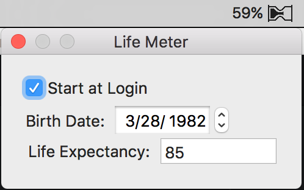

# Life Meter

An idea that tickled me enough that I had to implement it before I could go to
sleep. LifeMeter will display a small meter on your MacOS status bar, similar
to the battery meter, tracking your progress through your time on this planet.

Make sure to configure your birth date and life expectancy.

## Installation

Download the latest release from [the releases page](https://github.com/codekitchen/LifeMeter/releases),
and drag it to your Applications folder.

## Development

LifeMeter uses a standard Xcode setup. Note there is a small embedded helper
application, necessary for the "start at login" functionality.

If "Start at Login" doesn't work on your local dev box, make sure to read through http://stackoverflow.com/questions/27876046/error-when-enabling-auto-login-of-mac-os-app-using-a-helper
